# Dutique
Dutique is a lighthearted, AI-powered task creator focused on home organization and cleanliness. Whether you're tidying up the kitchen, refreshing your living space, or getting the whole family involved, Dutique conjures up practical and motivating household tasks to keep things running smoothly. Designed to be simple, cheerful, and helpful — it's your go-to tool for turning chores into small wins and tidy moments. 🧹🪴

## 🧺✨ Task Generation Chain

```mermaid
flowchart LR
 id1["**Function Step:**
 Task Generation"] -->
 id2["**LLM Step:**
 Description Generation"] -->
 id3{"**LLM Step:**
 Quality Check"}
 id3 -->|"Fail & attempts < 5"| id4["**LLM Step:**
 Repair Process"]
 id4 --> id3
 id3 -->|"Fail & attempts ≥ 5"| id5["Failed"]
 id3 -->|"Pass"| id6["Successful"]
 id6 --> id7["**Storage:**
 ChromaDB"]
 %% Styling
 classDef functionStep fill:#d4f1f9,stroke:#05a3d6,stroke-width:2px,color:black
 classDef llmStep fill:#ffe6cc,stroke:#ff9933,stroke-width:2px,color:black
 classDef decision fill:#fff2cc,stroke:#ffcc00,stroke-width:2px,shape:diamond,color:black
 classDef success fill:#d5e8d4,stroke:#82b366,stroke-width:2px,color:black
 classDef failure fill:#f8cecc,stroke:#b85450,stroke-width:2px,color:black
 classDef storage fill:#e1d5e7,stroke:#9673a6,stroke-width:2px,color:black
 class id1 functionStep
 class id2,id4 llmStep
 class id3 decision
 class id6 success
 class id5 failure
 class id7 storage
```

### Chain nodes:

- **Task Generation:**
    - Initial task creation through code functions (difficulty level, time required, category)
- **Description Generation:**
    - LLM creates engaging descriptions based on generated task parameters and RAG database
- **Quality Check:**
    - LLM checks the task quality criteria
- **Repair Process:**
    - Tasks failing quality checks undergo repair (up to 5 attempts) by an LLM that tries to improve the task
- **Storage:**
    - Successfully verified tasks are stored for retrieval in ChromaDB

## 🛠️ Get Started
To get Dutique up and running, please install the following software:

- Ollama
    - Ensure that Ollama is properly configured and reachable from outside. For more information on configuring Ollama, refer to the [Ollama FAQ](https://github.com/ollama/ollama/blob/main/docs/faq.md).
- Docker & Docker Compose

Then run:

```bash
# Download LLM Modell
ollama pull llama3.2:latest

# Clone the repo
git clone https://github.com/wmneco/Dutique
cd Dutique

# Start up the project
docker compose up
```